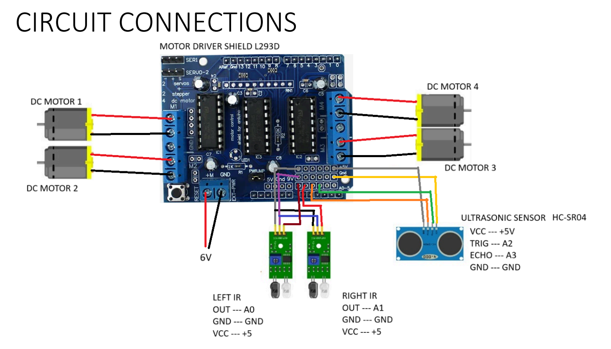

## 📊 Project Presentation
[View Project PDF](Line-Following-Obstacle-Avoiding-Robot.pdf)

## Abstract

This project presents an Arduino-based robot designed for line following and obstacle
avoidance. The robot uses infrared sensors to follow a marked path and ultrasonic sensors to
detect and respond to obstacles in real time. The integration of these functionalities enables
accurate navigation, collision prevention and safe movement across varying environments. The
robot illustrates how embedded systems and sensor integration can be applied to real-world
industrial and service robotics applications. 

Here is the circuit diagram:

## Key Lessons Learned from Our Arduino Project

- **Precise calibration of IR sensors** is critical, particularly under varying lighting conditions.  
- **Maintaining a stable battery voltage** is important due to Arduino’s high power consumption.  
- **Properly soldering DC motors** ensures smoother maneuvering, though wheel friction issues may still require manual adjustment.  
- **Iterative code tuning** for delay and speed optimization is essential to achieve reliable performance.  
